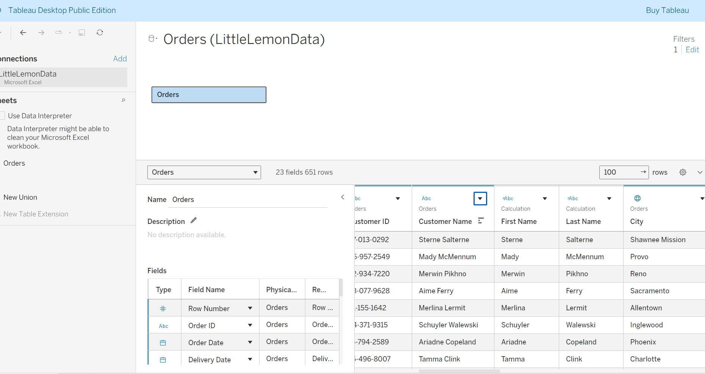
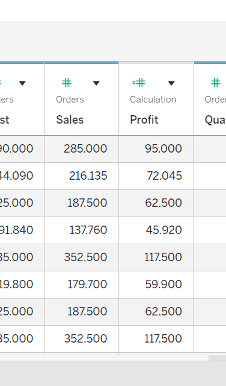
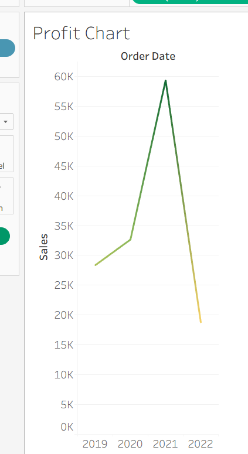

# meta-database-engineer-capstone
Repository created for Meta Data Base Engineer Capstone Project 

## Index

1. Database Setup [Go](#littlelemon-database-modeling-and-schema-creation)
2. Create virtual tables [Go](#create-a-virtual-table-to-summarize-data)
3. Creat optimized queires to manage and analyze data [Go](#create-optimized-queires-to-manage-and-analyze-data)
4. Create SQL queries to add and update bookings [Go](#create-sql-queries-to-add-and-update-bookings)
5. Set up the Tableau Workspace for data analysis [Go](#5-set-up-the-tableau-workspace-for-data-analysis)
6. Create interactive dashboard for sales and profits [Go](#6-create-interactive-dashboard-for-sales-and-profits)
7. Set up the client project [Go](#7-set-up-the-client-project)
8. Add query functions [Go](#8-add-query-functions)


## 1. LittleLemon Database Modeling and Schema Creation 


### Prerequisites 
Use MySQL Workbench to create the ER diagram and to implement it in your MySQL server.


#### Task Instructions 
Little Lemon wants you to use MySQL Workbench to develop a relational database system and implement it in MySQL server. Save your database capstone project files in a folder on your machine and name it db-capstone-project.


#### Task 1
In this task, you need to create a normalized ER diagram (that adheres to 1NF, 2NF and 3NF) with relevant relationships to meet the data requirements of Little Lemon. When creating your diagram, include the following tables:

* Bookings: To store information about booked tables in the restaurant including booking id, date and table number.

* Orders: To store information about each order such as order date, quantity and total cost.

* Order delivery status: To store information about the delivery status of each order such as delivery date and status.

* Menu: To store information about cuisines, starters, courses, drinks and desserts.

* Customer details: To store information about the customer names and contact details.

* Staff information: Including role and salary.

Here is some guidance for completing this task:

* Identify entities and related attributes. 

* Identify primary and foreign keys.

* Define data types and constraints. 

Once you have designed your ER diagram inside your MySQL Workbench Model Editor you then need to save your data model as LittleLemonDM and export it as a PNG file.


### Task 2
In this second task, you need to implement the Little Lemon data model inside your MySQL server. Here is some guidance for completing this task:

* Use the forward engineer method in MySQL Workbench to implement the Little Lemon data model inside MySQL server. 

* Name your database LittleLemonDB. 

Export the LittleLemonDB as a single contained SQL file and save it in the db-capstone-project folder.


### Task 3
In the third and final task, you need to show the databases in the MySQL server. Write a SQL code inside MySQL Workbench SQL editor to show all your databases in MySQL server. Check if the Little Lemon database is included in the list.


## 2. Create virtual tables to summarize data

### Task instructions

Little Lemon need you to create some reports on the orders placed in the restaurant. Complete the following tasks to help Little Lemon obtain the relevant information about the menu’s orders.

Little Lemon uses an à-la-carte model. Customers may order any single item, including starter-only, dessert-only, or drinks-only items.

### Task 1

In the first task, Little Lemon need you to create a virtual table called OrdersView that focuses on OrderID, Quantity and Cost columns within the Orders table for all orders with a quantity greater than 2. 

Here’s some guidance around completing this task: 

* Use a CREATE VIEW statement.

* Extract the order id, quantity and cost data from the Orders table.

* Filter data from the orders table based on orders with a quantity greater than 2. 

You can query the OrdersView table using the following syntax:

```
     Select * from OrdersView;
```


 


Depending on your schema, this column may be named TotalCost. The screenshot uses Cost for simplicity.

### Task 2

For your second task, Little Lemon need information from four tables on all customers with orders that cost more than $150. Extract the required information from each of the following tables by using the relevant JOIN clause: 

* Customers table: The customer id and full name.

* Orders table: The order id and cost.

* Menus table: The menus name.

* MenusItems table: the item’s name and category (e.g., starter, main, dessert, drink).

The result set should be sorted by the lowest cost amount.


### Task 3

For the third and final task, Little Lemon need you to find all menu items for which more than 2 orders have been placed using a subquery. You can carry out this task by creating a subquery that lists the menu names from the menus table for any order quantity with more than 2.

Here’s some guidance around completing this task: 

* Use the ANY operator in a subquery

* The outer query should be used to select the menu name from the menus table.

* The inner query should check if any item quantity in the order table is more than 2. 


## 3. Create optimized queires to manage and analyze data

### Task 1

In this first task, Little Lemon need you to create a procedure that displays the maximum ordered quantity in the Orders table. 

Creating this procedure will allow Little Lemon to reuse the logic implemented in the procedure easily without retyping the same code over again and again to check the maximum quantity. 

You can call the procedure GetMaxQuantity and invoke it as follows:

```
     CALL GetMaxQuantity();
```


### Task 2

In the second task, Little Lemon need you to help them to create a prepared statement called GetOrderDetail. This prepared statement will help to reduce the parsing time of queries. It will also help to secure the database from SQL injections.

The prepared statement should accept one input argument, the CustomerID value, from a variable. 

The statement should return the order id, the quantity and the order cost from the Orders table. 

Once you create the prepared statement, you can create a variable called id and assign it value of 1. 

Then execute the GetOrderDetail prepared statement using the following syntax:

```
     SET @id = 1;
     EXECUTE GetOrderDetail USING @id;

```


### Task 3

Your third and final task is to create a stored procedure called CancelOrder. Little Lemon want to use this stored procedure to delete an order record based on the user input of the order id.

Creating this procedure will allow Little Lemon to cancel any order by specifying the order id value in the procedure parameter without typing the entire SQL delete statement.   


## Create SQL queries to check available bookings based on user input

### Task 1

Little Lemon wants to populate the Bookings table of their database with some records of data. Your first task is to replicate the list of records in the following table by adding them to the Little Lemon booking table. 

You can use simple INSERT statements to complete this task.

| BookingID    | BookingDate  | TableNumber  | CustomerID |
| ------------ | -------------| ------------ | ---------- |
|    1         |   2022-10-10 |    5         |        1   |
|    2         |   2022-11-12 |    3         |        3   |
|    3         |   2022-10-11 |    2         |        2   |
|    4         |   2022-10-13 |    2         |        1   |


### Task 2

For your second task, Little Lemon need you to create a stored procedure called CheckBooking to check whether a table in the restaurant is already booked. Creating this procedure helps to minimize the effort involved in repeatedly coding the same SQL statements.

The procedure should have two input parameters in the form of booking date and table number. You can also create a variable in the procedure to check the status of each table.


### Task 3

For your third and final task, Little Lemon need to verify a booking, and decline any reservations for tables that are already booked under another name. 

Since integrity is not optional, Little Lemon need to ensure that every booking attempt includes these verification and decline steps. However, implementing these steps requires a stored procedure and a transaction. 

To implement these steps, you need to create a new procedure called AddValidBooking. This procedure must use a transaction statement to perform a rollback if a customer reserves a table that’s already booked under another name.  

Use the following guidelines to complete this task:

* The procedure should include two input parameters in the form of booking date and table number.

* It also requires at least one variable and should begin with a START TRANSACTION statement.

* Your INSERT statement must add a new booking record using the input parameter's values.

* Use an IF ELSE statement to check if a table is already booked on the given date. 

* If the table is already booked, then rollback the transaction. If the table is available, then commit the transaction. 


## 4. Create SQL queries to add and update bookings

### Task 1

In this first task you need to create a new procedure called AddBooking to add a new table booking record.

The procedure should include four input parameters in the form of the following bookings parameters:

* booking id, 

* customer id, 

* booking date,

* and table number.


### Task 2

For your second task, Little Lemon need you to create a new procedure called UpdateBooking that they can use to update existing bookings in the booking table.

The procedure should have two input parameters in the form of booking id and booking date. You must also include an UPDATE statement inside the procedure. 


### Task 3


For the third and final task, Little Lemon need you to create a new procedure called CancelBooking that they can use to cancel or remove a booking.

The procedure should have one input parameter in the form of booking id. You must also write a DELETE statement inside the procedure. 


## 5. Set up the Tableau Workspace for data analysis

### Task 1

In this first task, you need to connect to Little Lemon data stored in the Excel Sheet called LittleLemonDB. Then filter data in the data source page and select the United States as the country.

Here’s some guidance for completing this task:

* Open Tableau. In the Connection Pane select Excel, then navigate to the data source.

* In the data source page, select Filter Tab.


### Task 2

In the second task, you need to create two new data fields called First Name and Last Name. Related values should be extracted from the Full Name field.

Here’s some guidance for completing this task:

* You can use the Split feature in Tableau.

* Rename the new fields.





### Task 3

For your third task, you need to create a new data field that stores the profits for each sale, or order as shown in the screenshot below.

Here’s some guidance for completing this task:

* Select Sales field in the Data Pane, then select Create Calculated field. 

* Name the calculated field Profit.

* Write a formula that deducts Cost from Sales. 




## 6. Create interactive dashboard for sales and profits

### Task 1

In the first task, you need to create a bar chart that shows customers sales and filter data based on sales with at least $70.

Here’s some guidance for completing this task:

* Drag and drop relevant fields from the data pane into the shelves section.

* Use a suitable colour scheme.

* Filter sales based on sales >= $70.

* Name the chart Customers sales.

If you roll over a bar, the customer names and sale figures should be displayed as shown below.


### Task 2

In the second task, you need to create a line chart to show the sales trend from 2019 to 2022. 

Here’s some guidance for completing this task:

* Drag and drop relevant fields from the data pane.

* Use a suitable colour scheme.

* Filter data to exclude 2023.

* Name the chart Profit chart.

Your chart should show the trend of sales from 2019 to 2022 only as shown below. 





### Task 3

In the third task, you need to create a Bubble chart of sales for all customers. The chart should show the names of all customers. Once you roll over a bubble, the chart should show the name, profit and sale.

Here’s some guidance for completing this task:

* Drag and drop relevant fields from the data pane.

* Use a suitable colour scheme.

* Name the chart Sales Bubble Chart.

* Your chart should show the following Bubble chart.


#### Task 4


In this task, you need to compare the sales of the three different cuisines sold at Little Lemon. Create a Bar chart that shows the sales of the Turkish, Italian and Greek cuisines.

You need to display sales data for 2020, 2021, and 2022 only. Each bar should display the profit of each cuisine. 

Here’s some guidance for completing this task:

* Drag and drop relevant fields from the data pane.

* Use a suitable color scheme.

* Name the worksheet Cuisine Sales and Profits.

* Sort data in descending order by the sum of the sale.

Your chart should be similar to the following example:


### Task 5


In this final task, you need to create an interactive dashboard that combines the Bar chart called Customers sales and the Sales Bubble Chart. Once you click a bar, and roll over the related bubble, the name, sales and profit figures should be displayed in the Bubble chart as shown below.


## 7. Set up the client project

### Task 1

Your first task is to navigate to your terminal and ensure that Python is installed and available on the command path. To complete this task, type the following syntax:

```
pipenv install --python 3.12
pipenv shell 
```
This should display the version number of the python installed. Your OS should be running Python version 3. If faced with an earlier version of Python, or a command not found message, navigate to 
https://www.python.org/downloads/
 for instructions on how to configure and install an appropriate version for your operating system. 


### Task 2

Having established that an up-to date version of python is installed on your machine you will need to install Jupyter. You can install Jupyter using the following code: 

```
     pipenv install jupyter

```

Once Jupyter is installed, you can open a notebook by typing the following command in the terminal:

```
     jupyter notebook
```

Once you’ve opened Jupyter, you then need to create a new notebook for writing your code by clicking new and then selecting ipykernel. This action creates a new notebook from which you can compile code.


Task 3
Your third and final task is to establish a connection between Python and your database using the following steps:


Step One: 

Ensure that mysql-connector is installed by running the command in terminal:

```
     pipenv install mysql-connector
```

Step Two: 

Import the connector under the alias connector in jupyter code cell:

```
import mysql.connector as connector
```
Step Three: 

Verify that a connection can be made with your database by calling the connection method from the connector class: 
The Below code is mature connection method by creating a connection pool and then getting connection from this pool.  

```
from mysql.connector.pooling import MySQLConnectionPool
from mysql.connector import Error
import mysql.connector as connector

dbconfig = { 'user' : 'admindjango', 
        'host' : '192.168.0.73' ,  
        'password' : 'employee@123!',
        'auth_plugin' : 'mysql_native_password',
        'database' : 'little_lemon_db'}

try:
    pool = MySQLConnectionPool(pool_name = "ll_pool_a",
                           pool_size = 2, #default is 5
                           **dbconfig)
    print("The connection pool is created with a name: ",pool.pool_name)
    print("The pool size is:",pool.pool_size)

except Error as er:
    print("Error code:", er.errno)
    print("Error message:", er.msg)

try:
    print("Getting a connection from the pool.")
    connection1 = pool.get_connection()
except:
    print("No More connections are avaiable.")
    print("Adding new connection in the pool.")

    # Create a connection
    connection=connector.connect(**dbconfig)
        # Add the connection into the pool
    pool.add_connection(cnx=connection)
    print("A new connection is added in the pool.\n")

    print("Getting a connection from the pool.")
    connection1 = pool.get_connection()
```


## 8. Add Query Functions

### Task One

In the previous exercise you created a Python environment. In the first task of this exercise, you are tasked with extending the environment to connect with your database and interact with the data it holds. 

Your first step is to import the connector module, enter your user details and connect with the database (Hint: you can use an alias when importing the module).

This gives you access to all the functionality available from the connector API, which can be accessed through the variable named connector (or whichever alias you choose). 

To connect with your database, you can call the connect method of the connector class and pass in your details using the following code: 

```
# Connection as previous step via pool after that create cursor as

cursor = connection1.cursor()

```

This code should look very familiar to you from the previous course, apart from the parameter db. DB stands for database. When instantiating the connection, you can pass the database name here in place of calling the USE command later. 

The final step is to instantiate an instance of cursor to pass queries and return results (Hint: the cursor is part of the connection class outlined above).


### Task two

In this second task, you now need to query the database to show all tables within the database. 

Having established a connection in the first task, you need to execute a test query to ensure that there are no issues. You can do this by executing, or passing, a generic query that returns a snapshot of the database tables. 

You need to execute the query on the cursor using the code that follows. The cursor, as you should recall, is the bridge through which you can pass queries and return results. 

```
show_tables_query = "SHOW tables" 
cursor.execute(show_tables_query)

```
As before, a variable is used to hold the query. To gain a general insight, the query asks to display all tables within the database. 

The second line calls the cursor execute method. This method takes the Python string and ports it into a viable SQL statement. It then passes it to the database and returns the result. 

To view the results of your query, you can create another variable called results (Hint: the cursor has a method that can return all results in one call). 

To view the tables that are associated with a database, you can print out the results variable using the following code: 

```
result = cursor.fetchall()

print("Tables in LittleLemonDB are :")

for (database,) in result:
    print(database.decode('utf-8'))

```

### Task 3

#### Query with table JOIN

For the third and final task, Little Lemon need you to return specific details from your database. They require the full name and contact details for every customer that has placed an order greater than $60 for a promotional campaign. 

You can use the following steps to implement this functionality in your database directory:


Step One: Identify which tables are required. To complete the query, you first need to identify which table has the required data. 

The bill paid can be found in Orders as TotalCost and the customer contact information can be found in the Customers table. 

When selecting attributes from a specific table, specify the table name, followed by a dot and the target attribute as below (Hint: select the column attributes that you will need). 


Step Two: Next, specify a table (Hint: The FROM keyword allows you to identify a table.)

To join two tables, specify the type of JOIN and the attribute to join the table on. The tables must be joined on an attribute that is common to both tables (such as a common column).


Step Three: Finally, include a clause to filter the data on. (Hint: the WHERE clause can be used to add conditional parameters.) 

When you have completed these steps, wrap this query as a string and pass it to the .execute() method of the cursor class. When executed, your SELECT query must extract the full name, contact details and bill amount for every customer who spent more than $60.

