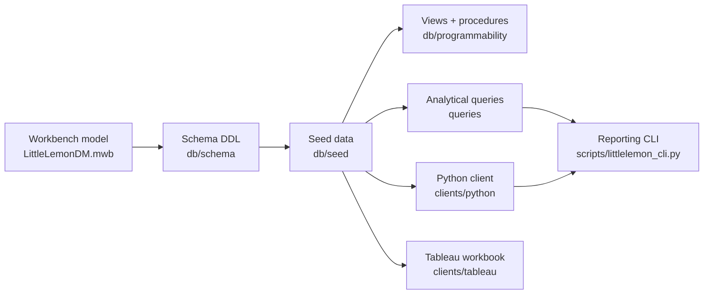
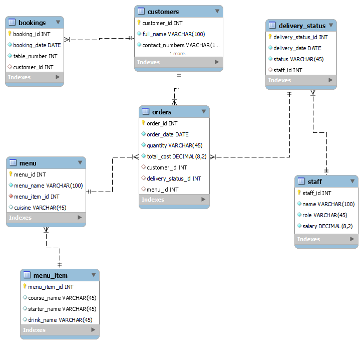

# Little Lemon Database — Meta Database Engineer Capstone


A complete restaurant database, built end to end: a normalised MySQL 8 schema, analytical SQL
(views, joins, subqueries, stored procedures, transactions), an interactive Tableau dashboard,
and a Python client with a reporting CLI.

> **Disclaimer:** This is an independent educational/portfolio project, not affiliated with,
> authorised, or endorsed by Meta or Coursera. See [NOTICE.md](NOTICE.md).

## About this project

Little Lemon is a small à-la-carte restaurant. This repository models its day-to-day
operations — customers, bookings, orders, delivery, menu and staff — then builds the queries,
reports and dashboard the business would use to run and analyse itself. It demonstrates
relational modelling and normalisation, practical SQL and transaction handling, data
visualisation, and Python database access.

| At a glance | |
|---|---|
| **Type** | Educational portfolio capstone. |
| **Stack** | MySQL 8, SQL, Python 3.12, Tableau, Docker Compose. |
| **Schema** | 7 tables, normalised to 3NF, modelled in MySQL Workbench. |
| **Data** | Synthetic — 50 customers, 200 orders, 40 bookings, 20 menu items, 20 staff. |
| **Output** | Analytical SQL, stored procedures, a Tableau dashboard, a notebook and a CLI. |
| **Verified** | One-command Docker setup; `make verify` runs the readiness checks. |

## Documentation map

| Document | What it covers |
|---|---|
| [docs/README.md](docs/README.md) | Documentation index and architecture. |
| [docs/database-design.md](docs/database-design.md) | ER model, normalisation, the seven tables. |
| [docs/queries-and-procedures.md](docs/queries-and-procedures.md) | Views, joins, subqueries, procedures, transactions. |
| [docs/visualization.md](docs/visualization.md) | The Tableau analysis and dashboard. |
| [docs/python-client.md](docs/python-client.md) | The Jupyter notebook and the reporting CLI. |
| [docs/setup.md](docs/setup.md) | Configuration, Docker and local MySQL, Make targets. |
| [NOTICE.md](NOTICE.md) | Attribution, non-affiliation, data and security notes. |
| [LICENSE](LICENSE) | MIT license. |
| [CITATION.cff](CITATION.cff) | How to cite this software. |
| [CONTRIBUTING.md](CONTRIBUTING.md) | Layout, conventions and contribution guidance. |
| [CHANGELOG.md](CHANGELOG.md) | Release history. |

## Architecture




The schema defines the tables, the seed script fills them, and every consumer reads from the
same source of truth.

## Database design

Seven tables, normalised to third normal form with declared foreign keys throughout.

| Table | Purpose |
|---|---|
| `customers` | Name and contact details. |
| `bookings` | Table reservations. |
| `orders` | Order header (date, quantity, total cost, customer, menu). |
| `delivery_status` | Delivery state and assigned staff. |
| `menu` | A menu per item, with cuisine. |
| `menu_item` | Course / starter / drink composition. |
| `staff` | Name, role and salary. |

The full ER model, normalisation notes and screenshots are in
[docs/database-design.md](docs/database-design.md).



## Quickstart

Copy the configuration template, then start the database. Docker loads the schema, seed data
and stored procedures automatically on first start.

```bash
cp .env.example .env      # fill in your own local credentials
make db-up                # start MySQL 8 and load everything
make health               # connectivity and row counts
make cli ARGS="summary"   # headline business metrics
```

Using a local MySQL server instead? Run the three scripts in the order given in
[docs/setup.md](docs/setup.md#option-b--local-mysql).

## Make targets

| Target | Runs |
|---|---|
| `make db-up` | `docker compose up -d`, then waits for the healthcheck. |
| `make db-down` | Stops the stack, keeps the data volume. |
| `make db-reset` | Wipes and recreates the stack (`down -v` + `up`). |
| `make health` | CLI connectivity and row counts. |
| `make summary` | CLI headline metrics. |
| `make cli ARGS="…"` | Pass-through to the reporting CLI. |
| `make verify` | Readiness checks (`scripts/verify.sh`). |
| `make clean` | Removes caches and local exports. |

## Limitations and possible improvements

- `menu_item` stores course, starter and drink as columns rather than a fully normalised
  `menu_items(item_name, category)` table.
- There is no integration test suite; CI covers dependency install, import, syntax and link
  checks only.
- The SQL exercise scripts hard-code example values (they are teaching scripts, not
  parameterised jobs).
- The Tableau workbook (`.twb`) needs Tableau Desktop or Tableau Public to open.

## Attribution and license

- Inspired by the **Meta Database Engineer** course on Coursera. The course's own material is
  not included; problem statements are rephrased in the author's own words. See
  [NOTICE.md](NOTICE.md).
- All customer, staff, order and menu data is **synthetic**.
- Credentials are never stored in the repository; configuration is read from a git-ignored
  `.env` (see [.env.example](.env.example)).
- Original code and documentation are released under the [MIT License](LICENSE). If you use
  this project, see [CITATION.cff](CITATION.cff).
