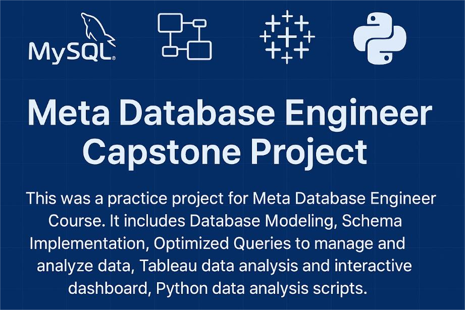
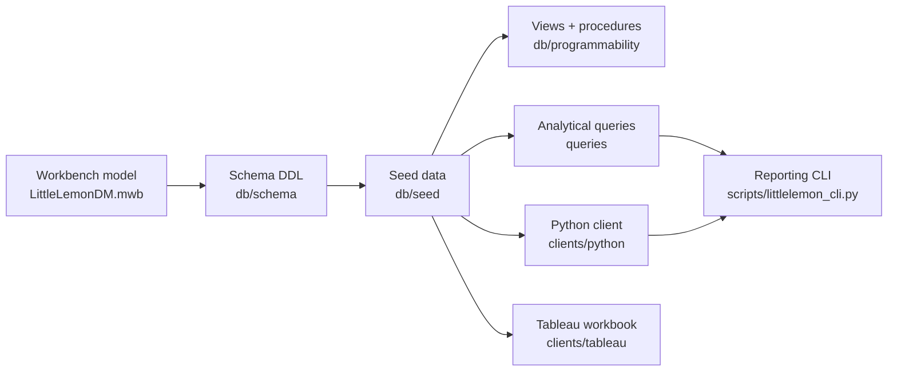

# Documentation

Index and architecture notes for the Little Lemon database. Start here, then follow the
link for the area you care about.

## Contents

- [Database design](database-design.md) — ER model, normalisation, the seven tables.
- [Queries and procedures](queries-and-procedures.md) — views, joins, subqueries,
  stored procedures and transactions.
- [Visualization](visualization.md) — the Tableau analysis and dashboard.
- [Python client](python-client.md) — the Jupyter notebook and the reporting CLI.
- [Setup](setup.md) — requirements, configuration, and running the project.

## Documentation map

| Document | Answers |
|---|---|
| [`README.md`](../README.md) | What is this project, and how do I run it in one minute? |
| [`database-design.md`](database-design.md) | How is the schema modelled and normalised? |
| [`queries-and-procedures.md`](queries-and-procedures.md) | What SQL and database logic exists? |
| [`visualization.md`](visualization.md) | How is the data analysed in Tableau? |
| [`python-client.md`](python-client.md) | How does the Python client connect and report? |
| [`setup.md`](setup.md) | How do I configure and start everything? |
| [`../NOTICE.md`](../NOTICE.md) | Attribution, non-affiliation and data notes. |
| [`../CONTRIBUTING.md`](../CONTRIBUTING.md) | Layout and conventions for contributors. |
| [`../CHANGELOG.md`](../CHANGELOG.md) | What changed, and when. |

## How the pieces fit together

The database is the hub: the schema defines the tables, the seed script populates them, and
every consumer — the SQL scripts, the notebook, the CLI and the Tableau workbook — reads from
the same source of truth.

## Directory layout

| Path | Holds |
|---|---|
| `db/schema/` | Forward-engineered schema, Workbench model, ER and database screenshots. |
| `db/seed/` | Synthetic seed data (`littlelemon_dummy_data.sql`). |
| `db/programmability/` | Consolidated, idempotent views and stored procedures. |
| `queries/` | The four step-by-step SQL exercise scripts and their result screenshots. |
| `clients/python/` | Jupyter notebook and its screenshots. |
| `clients/tableau/` | Tableau workbook, Excel export and dashboard screenshots. |
| `scripts/` | `littlelemon_cli.py`, the reporting CLI. |
| `docs/` | This documentation suite. |
