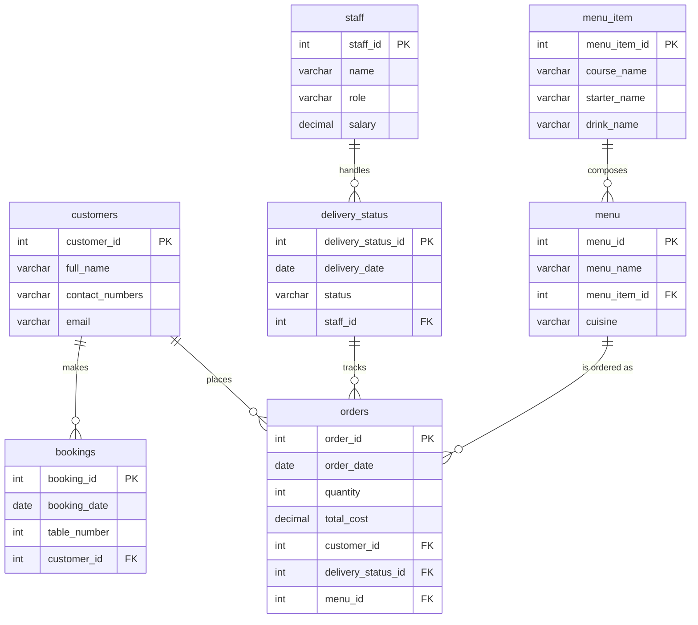
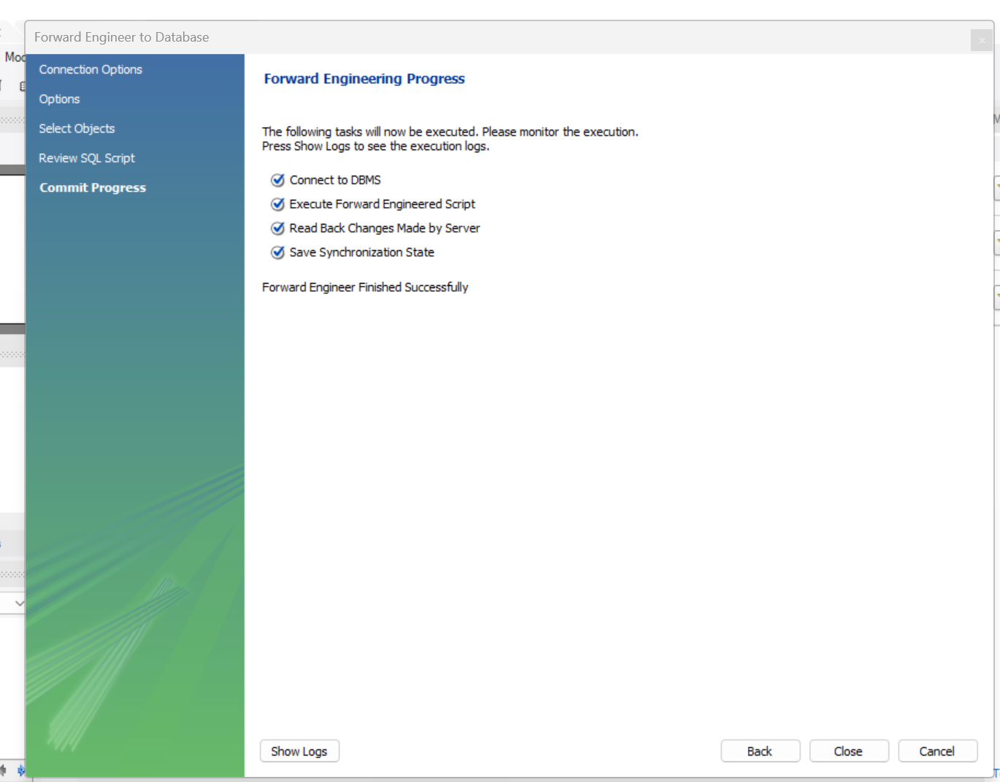
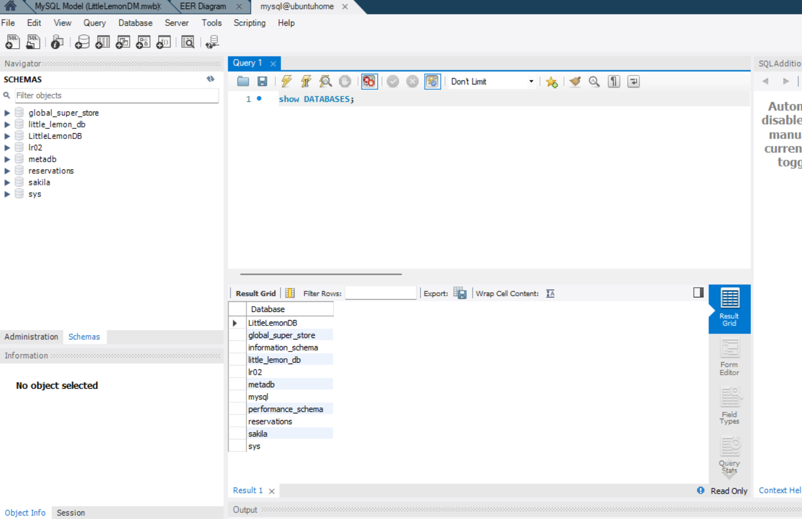

# Database design

How the Little Lemon schema is modelled: the entity-relationship model, the normalisation
decisions behind it, and the seven tables that make up the database.

## Contents

- [Entity-relationship model](#entity-relationship-model)
- [Normalisation](#normalisation)
- [Tables](#tables)
- [Relationships and referential actions](#relationships-and-referential-actions)
- [Model and generated schema](#model-and-generated-schema)
- [Related documents](#related-documents)

## Entity-relationship model

The model was designed in MySQL Workbench and contains seven entities. The exported diagram
is shown below, followed by the same structure as a Mermaid `erDiagram`.

## Normalisation

The schema is normalised to third normal form for the core entities:

| Form | How it is satisfied |
|---|---|
| **1NF** | Every column holds a single atomic value; each table has a surrogate primary key. |
| **2NF** | No partial dependencies — each non-key attribute depends on the whole primary key. |
| **3NF** | No transitive dependencies — descriptive attributes such as a menu's cuisine live with the menu, not with each order. |

One deliberate simplification is documented as a possible improvement: `menu_item` stores the
course, starter and drink as three columns rather than a fully normalised
`menu_items(item_name, category)` table. See
[Possible improvements](../README.md#limitations--possible-improvements).

## Tables

| Table | Purpose |
|---|---|
| `customers` | Customer name and contact details. |
| `bookings` | Table reservations (date, table number, customer). |
| `orders` | Order header (date, quantity, total cost, customer, menu). |
| `delivery_status` | Delivery state of an order and the assigned staff member. |
| `menu` | A menu offered per item, with its cuisine. |
| `menu_item` | Course / starter / drink composition of a menu item. |
| `staff` | Staff name, role and salary. |

## Relationships and referential actions

All six foreign keys are declared with an index. Referential actions are consistent across the
schema: `RESTRICT` on delete (so parent rows cannot be removed while children reference them)
and `CASCADE` on update.

| Child column | Parent | On delete | On update |
|---|---|---|---|
| `bookings.customer_id` | `customers.customer_id` | RESTRICT | CASCADE |
| `delivery_status.staff_id` | `staff.staff_id` | RESTRICT | CASCADE |
| `menu.menu_item_id` | `menu_item.menu_item_id` | RESTRICT | CASCADE |
| `orders.customer_id` | `customers.customer_id` | RESTRICT | CASCADE |
| `orders.delivery_status_id` | `delivery_status.delivery_status_id` | RESTRICT | CASCADE |
| `orders.menu_id` | `menu.menu_id` | RESTRICT | CASCADE |

## Model and generated schema

The schema DDL was forward-engineered from the Workbench model
(`db/schema/LittleLemonDM.mwb`). The screenshots below show the generated database and the
resulting `LittleLemonDB` schema.

The forward-engineered DDL lives in
[`db/schema/LittleLemonDB-Schema-Script.sql`](../db/schema/LittleLemonDB-Schema-Script.sql).

## Related documents

- [Queries and procedures](queries-and-procedures.md) — the SQL that runs against these tables.
- [Setup](setup.md) — how to create the database locally.
- [Documentation index](README.md) — all docs at a glance.
