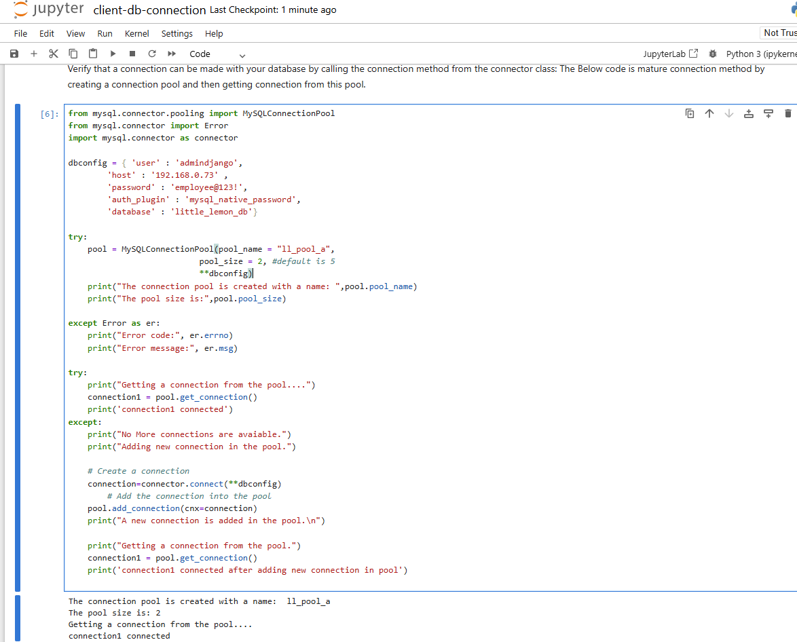
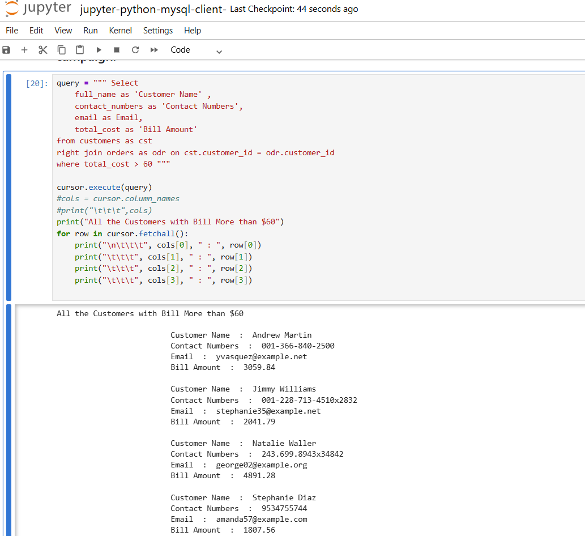
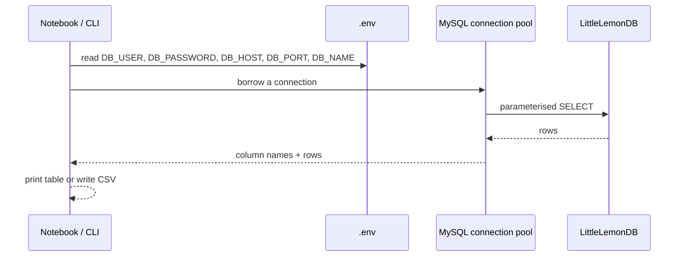

# Python client

How Python talks to the database: the Jupyter notebook for exploration, and the standalone
reporting CLI for repeatable, parameterised queries.

## Contents

- [Jupyter notebook](#jupyter-notebook)
- [Connection and configuration](#connection-and-configuration)
- [Reporting CLI](#reporting-cli)
- [Related documents](#related-documents)

## Jupyter notebook

[`clients/python/jupyter-python-mysql-client-.ipynb`](../clients/python/jupyter-python-mysql-client-.ipynb)
connects to MySQL through a **connection pool**, lists the database tables, and runs a
reporting query that returns every customer who spent more than $60.







## Connection and configuration

The client reads credentials from environment variables. `python-dotenv` is used when
installed; otherwise the client falls back to reading `.env` directly, so it works either way.

| Variable | Default | Used for |
|---|---|---|
| `DB_USER` | — | MySQL user. |
| `DB_PASSWORD` | — | MySQL password. |
| `DB_HOST` | `127.0.0.1` | Database host. |
| `DB_PORT` | `3306` | Database port. |
| `DB_NAME` | `LittleLemonDB` | Database name. |

Copy [`.env.example`](../.env.example) to `.env` before running. See [Setup](setup.md).

## Reporting CLI

[`scripts/littlelemon_cli.py`](../scripts/littlelemon_cli.py) is a standalone automation layer
over the same database. It uses the connection pool and environment configuration above, runs
parameterised read-only queries, and can export results to CSV.

| Command | What it prints |
|---|---|
| `health` | Connectivity and row counts per table. |
| `summary` | Headline metrics: orders, revenue, average order value, max quantity. |
| `cuisines` | Revenue grouped by cuisine. |
| `customers --min-total 60` | Customers above a spend threshold, optionally `--csv`. |
| `check --date YYYY-MM-DD --table N` | Whether a table is booked on a date. |

```bash
python scripts/littlelemon_cli.py health
python scripts/littlelemon_cli.py summary
python scripts/littlelemon_cli.py cuisines
python scripts/littlelemon_cli.py customers --min-total 60 --limit 10
python scripts/littlelemon_cli.py customers --min-total 60 --csv exports/customers.csv
python scripts/littlelemon_cli.py check --date 2022-11-12 --table 3
```

The CLI is read-only except for the queries it is explicitly given; CSV exports are written
under `exports/`, which is git-ignored.

## Related documents

- [Setup](setup.md) — configuration and starting the database.
- [Queries and procedures](queries-and-procedures.md) — the underlying SQL.
- [Documentation index](README.md) — all docs at a glance.
