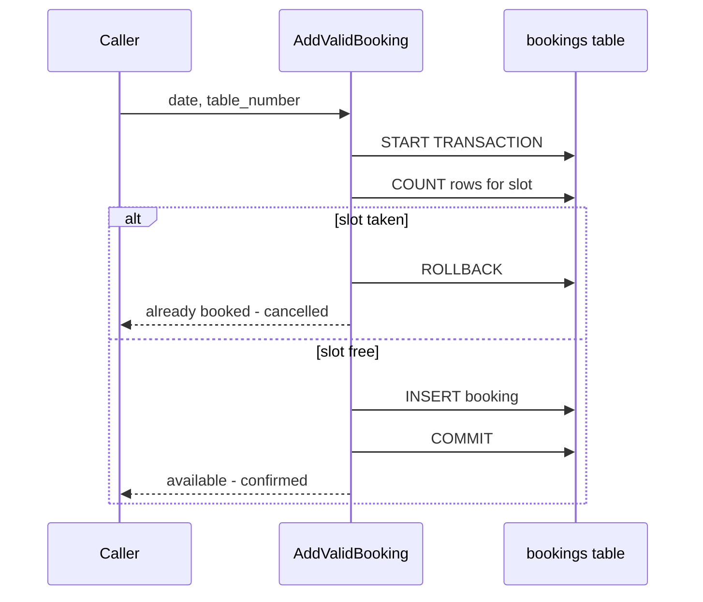

# Queries and procedures

The SQL story of the project: summary views, joins and subqueries, then stored procedures and
transactions for bookings and orders.

## Contents

- [Script index](#script-index)
- [Views, joins and subqueries](#views-joins-and-subqueries)
- [Stored procedures](#stored-procedures)
- [Booking validation and management](#booking-validation-and-management)
- [Result screenshots](#result-screenshots)
- [Related documents](#related-documents)

## Script index

| Script | Contains |
|---|---|
| [`queries/01-views-and-joins.sql`](../queries/01-views-and-joins.sql) | `OrdersView`, a four-table join, and an `ANY` subquery. |
| [`queries/02-stored-procedures.sql`](../queries/02-stored-procedures.sql) | `GetMaxQuantity`, a prepared statement, and `CancelOrder`. |
| [`queries/03-check-and-validate-bookings.sql`](../queries/03-check-and-validate-bookings.sql) | `CheckBooking` and the transactional `AddValidBooking`. |
| [`queries/04-manage-bookings-procedures.sql`](../queries/04-manage-bookings-procedures.sql) | `AddBooking`, `UpdateBooking`, `CancelBooking`. |
| [`db/programmability/LittleLemonDB-Programmability.sql`](../db/programmability/LittleLemonDB-Programmability.sql) | Consolidated, idempotent versions of every view and procedure above. |

The `queries/` scripts are the step-by-step exercises; the programmability script is the
**canonical** definition that the container loads at startup, so it is safe to re-run.

## Views, joins and subqueries

| Object | Type | What it does |
|---|---|---|
| `OrdersView` | View | Orders with a quantity greater than 2 (`OrderID`, `Quantity`, `Cost`). |
| Four-table join | Query | Joins `customers`, `orders`, `menu` and `menu_item` for orders costing more than 150. |
| `ANY` subquery | Query | Lists menu names whose orders have a quantity greater than 2. |

The view is defined as:

```sql
CREATE VIEW OrdersView AS
SELECT order_id AS OrderID, quantity AS Quantity, total_cost AS Cost
FROM orders
WHERE quantity > 2;
```


Join result:


Subquery result:


## Stored procedures

| Procedure | Signature | Purpose |
|---|---|---|
| `GetMaxQuantity` | `GetMaxQuantity()` | Returns the largest quantity in `orders`. |
| `GetOrderDetail` | prepared statement with `?` | Parameterised order lookup by customer id. |
| `CancelOrder` | `CancelOrder(id INT)` | Deletes an order by id and confirms. |


Prepared statement result:


Cancel order result:


## Booking validation and management

`CheckBooking` reports whether a slot is free. `AddValidBooking` is **transactional**: it
checks availability *before* inserting and rolls back if the table is already taken, which
avoids two concurrent inserts both passing the check.



The management procedures in `04` follow the same transaction pattern:

| Procedure | Signature | Purpose |
|---|---|---|
| `AddBooking` | `AddBooking(id, customer_id, table_number, date)` | Inserts a booking after an availability check. |
| `UpdateBooking` | `UpdateBooking(id, date)` | Moves an existing booking to a new date. |
| `CancelBooking` | `CancelBooking(id)` | Deletes a booking. |


## Result screenshots

Every result image lives in [`queries/results/`](../queries/results/):

| Screenshot | Shows |
|---|---|
| `Result of Virtual Table Query.png` | `OrdersView`. |
| `Result of Join Statement.png` | The four-table join. |
| `Result of SubQuery.png` | The `ANY` subquery. |
| `Result of StoreProcedure GetMaxQuantity.png` | `GetMaxQuantity`. |
| `Result of Prepared Statement.png` | The prepared statement. |
| `Result of CancelOrder procedure.png` | `CancelOrder`. |
| `Insert into Bookings 4 Entries.png` | Seeded bookings. |
| `Result of Select after Inserts.png` | Bookings after inserts. |
| `Result of CheckBooking Procedure.png` | `CheckBooking`. |
| `Result of AddValidBooking Procedure.png` | `AddValidBooking`. |
| `Result of AddBooking procedure.png` | `AddBooking`. |
| `Result of UpdateBooking Procedure.png` | `UpdateBooking`. |
| `Result of CancelBooking Procedure.png` | `CancelBooking`. |

## Related documents

- [Database design](database-design.md) — the tables these queries read.
- [Python client](python-client.md) — reporting queries in the notebook and CLI.
- [Documentation index](README.md) — all docs at a glance.
