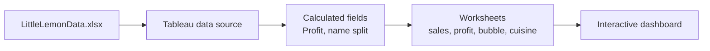
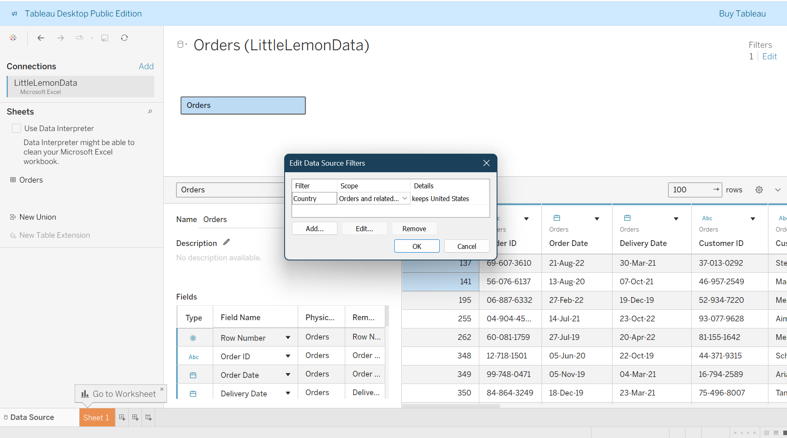
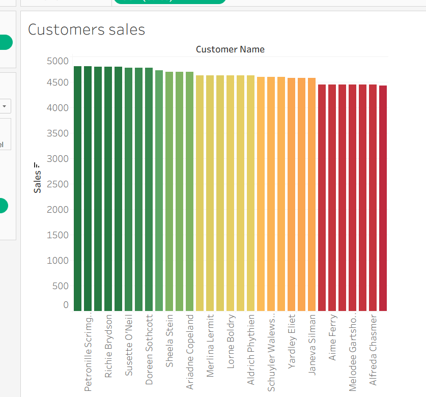
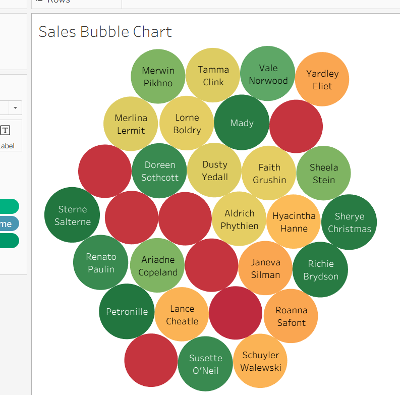
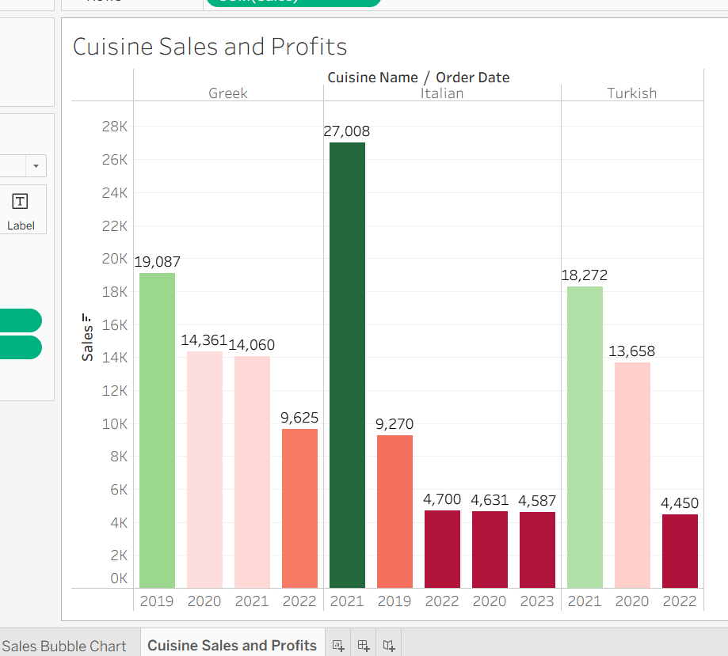
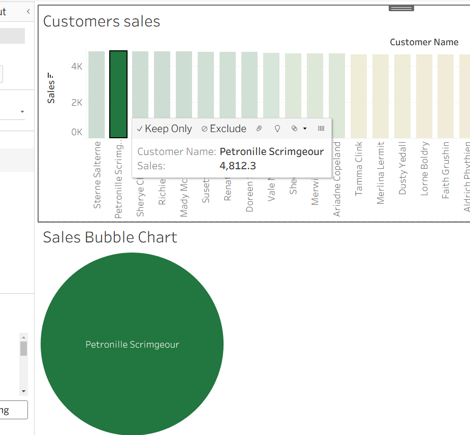

# Visualization

The Tableau analysis built on top of the restaurant data: derived fields, the individual
worksheets, and the interactive dashboard that combines them.

## Contents

- [Data source](#data-source)
- [Derived fields](#derived-fields)
- [Worksheets](#worksheets)
- [Interactive dashboard](#interactive-dashboard)
- [Related documents](#related-documents)

## Data source

The workbook reads an Excel export of the database tables,
[`clients/tableau/LittleLemonData.xlsx`](../clients/tableau/LittleLemonData.xlsx), and the
analysis is saved as
[`clients/tableau/LittleLemonDB-Tableau-Analysis.twb`](../clients/tableau/LittleLemonDB-Tableau-Analysis.twb).

Source selection and filtering:

## Derived fields

| Field | Definition | Why |
|---|---|---|
| `Profit` | `Sales - Cost` | Turns revenue into a margin figure for the charts. |
| Customer name split | Split the full name into first / last | Lets the dashboard group and filter by customer. |

## Worksheets

| Worksheet | Chart |
|---|---|
| Customer sales | Bar chart of sales per customer. |
| Profit | Trend of profit over the period. |
| Sales bubble | Bubble chart sized by sales. |
| Cuisine | Sales and profit compared by cuisine. |

## Interactive dashboard

The worksheets are combined into a single dashboard. Clicking a customer filters the
remaining views, so the sales and cuisine breakdowns follow the selection.

## Related documents

- [Database design](database-design.md) — where the analysed data comes from.
- [Python client](python-client.md) — the other consumer of the same data.
- [Documentation index](README.md) — all docs at a glance.
